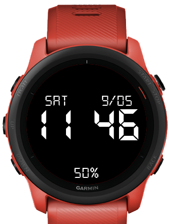

# Liquid Crystal

Garmin watchface

## How to develop

About prerequesites, please refer to [Garmin's Connect IQ basics](https://developer.garmin.com/connect-iq/connect-iq-basics/).

A VS Code run config is provided for launching the Garmin Simulator.